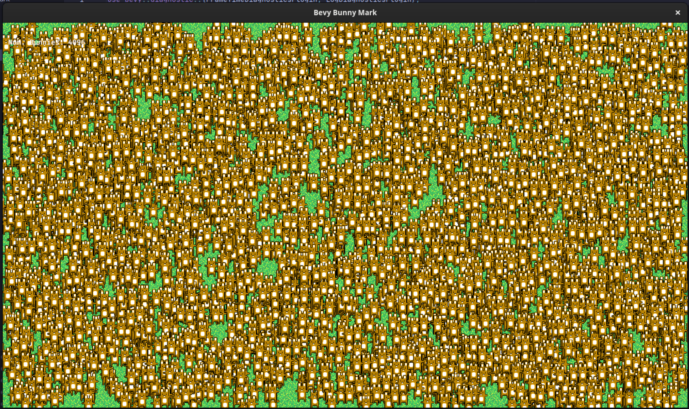

# bevy\_bunnymark

Simple implementation of the popular Bunny Mark in [Rust](https://www.rust-lang.org/) with [Bevy](https://bevyengine.org/).

The initial BunnyMark was created by [Ian Lobb (code)](http://blog.iainlobb.com/2010/11/display-list-vs-blitting-results.html)
and [Amanda Lobb (art)](http://amandalobb.com/)

Made for fun and to play around with bevy. This can probably be solved a lot better but its was kinda fun seeing how many
singular moving entities I can render on my notebook :).

## Usage

**Press SPACE to double the number of bunnies on the screen.**

## License

MIT
